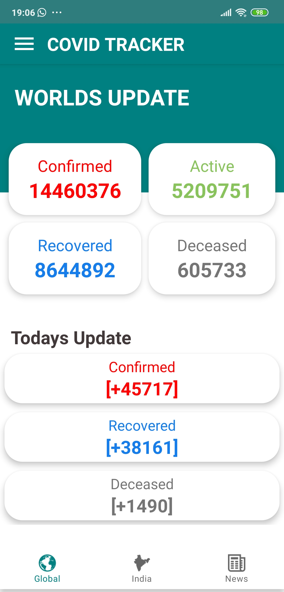
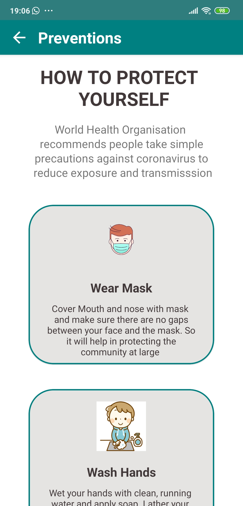

# Corona Tracker
  
Android app developed for helping peoples to get the no of cases of corona in India in real time and give news of no. of cases in one application.
I have attached screenshots below of the app.

### 1. Here you will get information of total cases and states.

  

### 2. You will able to see cases in the world.

  

### 3. Update of news.

  

### 4. Preventions of corona virus.

  

